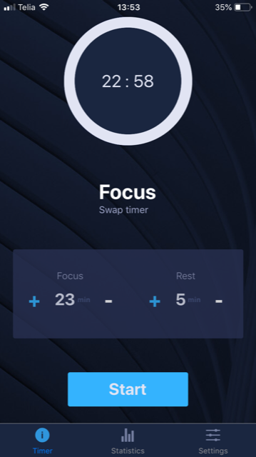
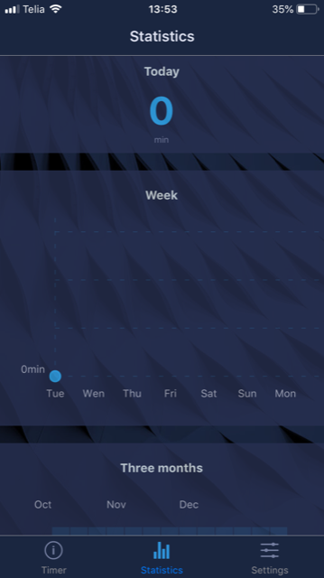
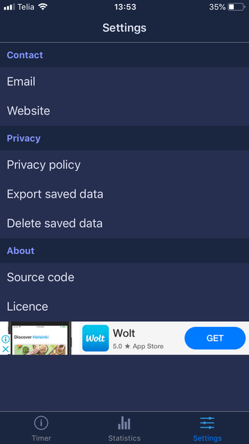

# FocusOwl
##### A simple and elegant productivity tool built with React-Native

### Running
[Node.js](https://nodejs.org/en/) and [Expo CLI](https://expo.io/learn) are required for running.

Clone or download the repo. 

Run in CMD, Powershell or Bash:

```
    expo install
```
Wait for the download to finish and the run:

```
    expo start
```
### Reasoning

The goal of this project was to get one foot into the Reac-Native and Expo world. In order to test out the available tooling. 


### Concept

The core idea is based off the [Pomodoro Technique](https://en.wikipedia.org/wiki/Pomodoro_Technique) developed by Francesco Cirillo. 
It aims to implement the core technique.
1. Decide on the task to be done.
2. Set the pomodoro timer (traditionally to 25 minutes).
3. Work on the task.
4. End work when the timer rings and put a checkmark on a piece of paper.
5. If you have fewer than four checkmarks, take a short break (3–5 minutes), then go to step 2.
6. After four pomodoros, take a longer break (15–30 minutes), reset your checkmark count to zero, then go to step 1.


### Some images
##### Function Demo


##### Screens
The application is split into three seperate screens. Home, statistics and settings. Statistics and settings page have an implementation of the Google Ads integration. 


|Home | Statistics | Settings |
:-------------------------:|:-------------------------:|:-------------------------:
||